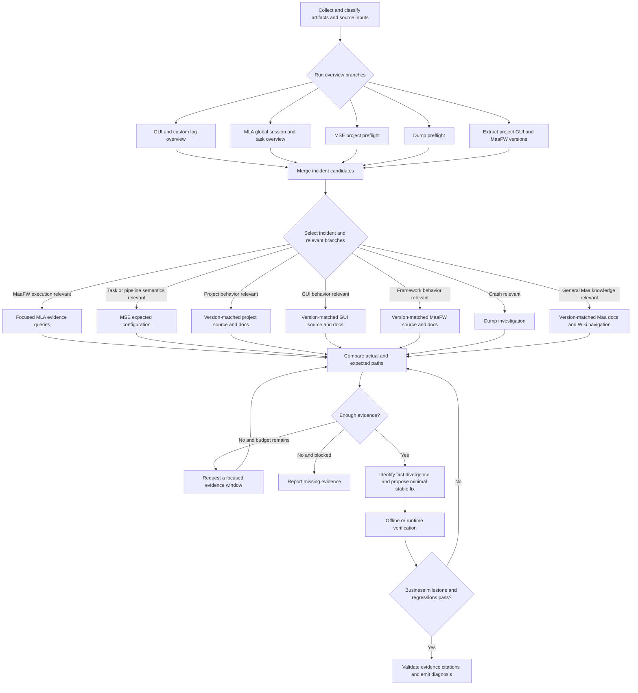

# Diagnostic workflow architecture

This document describes the target MaaDiagnosticExpert workflow and distinguishes it from the
smaller graph that is executable today.

## Diagnostic model

MDE separates deterministic facts from model interpretation:

- artifacts, logs, dumps, screenshots, configuration snapshots, and version-matched source are
  evidence;
- MLA parses and aggregates actual MaaFramework execution without inferring a root cause;
- MSE resolves the expected task and pipeline configuration through its public packages;
- source and documentation explain project, GUI, custom-agent, and framework semantics;
- the model selects relevant evidence, compares actual and expected behavior, and proposes a
  diagnosis and repair;
- validation rejects conclusions that do not cite evidence from the authoritative ledger.

GUI names and log formats are adapter concerns. Core discovery first looks in supplied artifacts
and common `debug/` or `logs/` locations, prefers a known GUI profile when available, and falls
back to generic classification. It must not assume MXU or a fixed custom-agent language.

## Python package boundaries

- `contracts` owns shared request, evidence, MLA, and workflow models, but no investigation policy;
- `discovery` resolves supplied inputs, repositories, and artifact source classifications;
- `inspection` owns deterministic inspection results, performs analysis, and constructs the
  authoritative evidence ledger;
- `reasoning` owns model protocols, prompts, configuration, and provider integrations;
- `workflow` owns LangGraph planning, transitions, and diagnosis validation;
- `interfaces` exposes the CLI, TypeScript adapter client, and reports.

The root package only re-exports the supported SDK surface. Tests mirror these domain packages so
module ownership remains visible during future MSE, source-research, and Wiki work.

## Target flow

MLA is not merely a fallback after GUI/custom-log analysis fails. Its global session and task
overview can corroborate an incident already located from user context or GUI logs. Conversely,
issues that never enter MaaFramework may skip MLA entirely.

## Incident and version handling

User descriptions and screenshots guide candidate selection but are not assumed reliable. GUI and
custom logs can identify the affected task and approximate time; MLA provides the strongest view
of MaaFramework execution. Candidates retain the observations that produced them, and ambiguous
selection remains explicit instead of choosing silently.

Project, GUI, and MaaFramework versions should be extracted from logs. A single artifact may span
multiple runtime versions, so every observation remains bound to its source, session, and time
where available. The workflow must resolve the issue revision before inspecting source; current
source is useful only to determine whether a later fix exists. A custom project agent normally
follows the project/resource revision rather than receiving a synthetic independent version.

## Source and knowledge lookup

Before source inspection, MDE resolves applicable `AGENTS.md` files for the repository revision
and target directory. Their scoped instructions govern structure, commands, and validation. Source
lookup then searches the project repository itself, including its own documentation.

MaaFramework documentation and future pipeline-writing guidance are searched at a fixed revision.
MDE does not require a maintainer to hand-author chunks: the model issues bounded searches and the
deterministic layer returns focused passages. A future Wiki may live in a separate Git repository,
published online and cached locally at a pinned revision. It is navigation knowledge, not runtime
evidence; conclusions must return to the original document or source before citing a fact.

## Repair and verification

A repair targets the first observed divergence and minimizes regression risk. For OCR pipeline
problems, the usual stable progression is:

1. correct `roi` or `only_rec` when capture scope is wrong;
2. correct `expected` or normalize known recognition variants with `replace`;
3. add `color_filter` only when evidence shows interfering colors and regression coverage exists;
4. change the OCR model mainly during early project setup, not as the default repair in a mature
   project.

A framework success event is not proof of business success. Verification checks explicit task
milestones where possible. Offline screenshots, especially failure or `on_error` captures, may
prove recognition/configuration changes; otherwise the workflow requests a runtime replay and
checks adjacent scenarios for regressions.

## Implementation status

Implemented now:

- explicit artifact and source preparation;
- bounded log-source classification with MaaFramework signatures and optional source profiles;
- bounded GUI/custom overview statistics and traceable warning/error occurrences;
- typed initial investigation planning;
- conditional MLA preflight/runtime inspection;
- source- and session-scoped MaaFramework runtime-version extraction with line-backed evidence;
- bounded incident candidate generation from notable MLA tasks and GUI/custom log occurrences;
- conditional model-assisted incident correlation with candidate/evidence reference validation;
- empty deterministic inspection for non-MLA inputs;
- evidence synthesis, pluggable model reasoning, citation validation, and diagnostic events.

Represented by contracts but deferred:

- additional real-world GUI/custom source profiles;
- MSE project and pipeline preflight;
- dump analysis;
- project/GUI version extraction and revision-matched source investigation;
- scoped `AGENTS.md` resolution;
- knowledge/Wiki search;
- bounded evidence-query loops, fix execution, and verification nodes.

`deferred` is an implementation status, not evidence that a branch is irrelevant. Benchmarks and
callers can use it to distinguish unavailable work from a deliberate `skip` decision.
