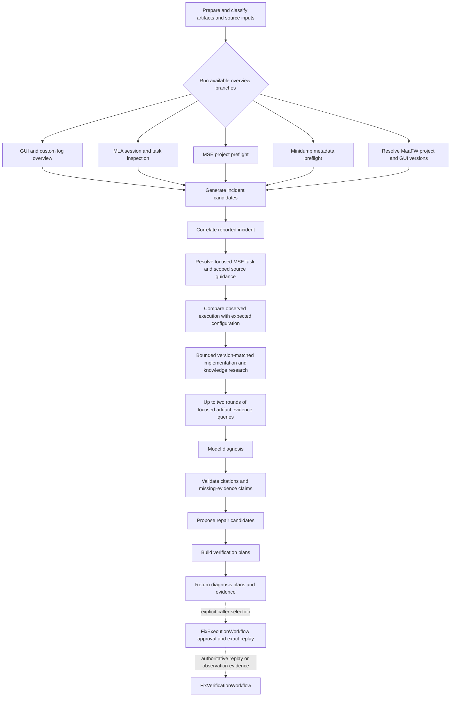

# Diagnostic workflow architecture

This document describes the executable MaaDiagnosticExpert MVP workflow and its remaining
post-MVP boundaries.

## Diagnostic model

MDE separates deterministic facts from model interpretation:

- artifacts, logs, dumps, screenshots, configuration snapshots, and version-matched source are
  evidence;
- MLA parses and aggregates actual MaaFramework execution without inferring a root cause;
- MSE resolves the expected task and pipeline configuration through its public packages;
- source and documentation explain project, GUI, custom-agent, and framework semantics;
- the model selects relevant evidence, compares actual and expected behavior, and proposes a
  diagnosis and repair;
- validation rejects conclusions that do not cite evidence from the authoritative ledger.

GUI names and log formats are adapter concerns. Core discovery first looks in supplied artifacts
and common `debug/` or `logs/` locations, prefers a known GUI profile when available, and falls
back to generic classification. It must not assume MXU or a fixed custom-agent language.

## Python package boundaries

- `contracts` owns shared request, evidence, MLA, workflow, and benchmark models, but no
  investigation policy;
- `discovery` resolves supplied inputs, repositories, and artifact source classifications;
- `inspection` owns deterministic inspection results, performs analysis, and constructs the
  authoritative evidence ledger;
- `knowledge` acquires and resolves verified, versioned Wiki catalogs;
- `reasoning` owns model protocols, prompts, configuration, and provider integrations;
- `workflow` owns LangGraph planning, transitions, and diagnosis validation;
- `benchmark` owns external diagnosis evaluation and deterministic scoring;
- `interfaces` exposes the CLI, TypeScript adapter client, and reports.

The root package only re-exports the supported SDK surface. Tests mirror these domain packages so
module ownership remains visible as the implementation grows.

## Executable MVP flow

MLA is not merely a fallback after GUI/custom-log analysis fails. Its global session and task
overview can corroborate an incident already located from user context or GUI logs. Conversely,
issues that never enter MaaFramework may skip MLA entirely.

## Incident and version handling

User descriptions and screenshots guide candidate selection but are not assumed reliable. GUI and
custom logs can identify the affected task and approximate time; MLA provides the strongest view
of MaaFramework execution. Candidates retain the observations that produced them, and ambiguous
selection remains explicit instead of choosing silently.

MaaFramework versions are extracted from runtime logs, while project and GUI versions can be
recorded from explicit, adapter-owned declarations in their supplied source roots. A single
artifact may span multiple runtime versions, so every observation remains bound to its source,
session, and time where available. The workflow must resolve the issue revision before inspecting
source; current source is useful only to determine whether a later fix exists. A custom project
agent normally follows the project/resource revision rather than receiving a synthetic independent
version.

## Source and knowledge lookup

Before source inspection, MDE resolves applicable `AGENTS.md` files for the repository revision
and target directory. Their scoped instructions govern structure, commands, and validation. Source
lookup then searches the project repository itself, including its own documentation.

MaaFramework documentation and pipeline-writing guidance are searched at a fixed revision.
MDE does not require a maintainer to hand-author chunks: the model issues bounded searches and the
deterministic layer returns focused passages. A Wiki may live in a separate Git repository, be
published online, and be cached locally at a pinned revision. It is navigation knowledge, not
runtime evidence; conclusions must return to the original document or source before citing a fact.

The knowledge surface accepts explicit local Git inputs. `documentation` marks original passages
that may be cited as context; `wiki` marks navigation passages that cannot be cited by a conclusion.
A Wiki match containing a fixed GitHub blob commit and path is followed only into an explicit
MaaFramework/documentation checkout at that exact commit, under the normal bounded source-window
limits. Missing or ambiguous original checkouts are recorded as missing evidence. MDE never updates,
clones, or downloads these repositories during diagnosis; online synchronization remains separate
work.

## Repair and verification

A repair targets the first observed divergence and minimizes regression risk. For OCR pipeline
problems, the usual stable progression is:

1. correct `roi` or `only_rec` when capture scope is wrong;
2. correct `expected` or normalize known recognition variants with `replace`;
3. add `color_filter` only when evidence shows interfering colors and regression coverage exists;
4. change the OCR model mainly during early project setup, not as the default repair in a mature
   project.

A framework success event is not proof of business success. Verification checks explicit task
milestones where possible. Offline screenshots, especially failure or `on_error` captures, may
prove recognition/configuration changes; otherwise the workflow requests a runtime replay and
checks adjacent scenarios for regressions.

## Implementation status

Implemented now:

- explicit artifact and source preparation;
- bounded log-source classification with MaaFramework signatures and optional source profiles;
- bounded GUI/custom overview statistics and traceable warning/error occurrences;
- typed initial investigation planning;
- conditional MLA preflight/runtime inspection;
- bounded Minidump exception and system metadata extraction without inferred root cause;
- revision-matched MSE project preflight through a one-shot read-only project snapshot;
- MSE interface task bindings, controller/resource configuration summaries, and static diagnostics;
- source- and session-scoped MaaFramework runtime-version extraction with line-backed evidence;
- explicit project and GUI release-version declarations with source-backed observations;
- bounded incident candidate generation from notable MLA tasks and GUI/custom log occurrences;
- conditional model-assisted incident correlation with candidate/evidence reference validation;
- bounded focused MSE task/node resolution after incident correlation, including effective
  configuration, references, and source-line evidence;
- deterministic actual/expected comparison that links correlated MLA observations to focused MSE
  task evidence without inferring a root cause;
- bounded scoped `AGENTS.md` resolution for focused version-matched project files;
- model-planned, bounded literal Git search over version-matched focused project source, with
  deterministic line-window evidence;
- model-planned, bounded literal Git search over version-matched GUI and MaaFramework
  implementation source;
- model-planned, bounded literal Git search over explicit MaaFramework/documentation/Wiki inputs,
  with navigation-only Wiki citation enforcement;
- deterministic Wiki-to-original follow-up for fixed-commit links and explicitly supplied,
  revision-matched original Git sources;
- up to two model-planned rounds of focused raw-artifact evidence windows, with deterministic path
  authorization and size limits;
- validated repair candidates and per-candidate verification plans after a complete diagnosis;
- standalone exact-request repair execution with mandatory harness-owned approval, plus bounded
  before/after snapshots and evidence-backed milestone/regression verification;
- external case/annotation contracts, independent model judging, and deterministic benchmark
  scoring with provenance validation;
- empty deterministic inspection when neither MLA nor MSE has an eligible input;
- evidence synthesis, pluggable model reasoning, citation validation, and diagnostic events.

Remaining beyond the MVP:

- additional real-world GUI/custom source profiles;
- full native dump debugging beyond built-in Minidump exception/system metadata;
- additional project/GUI version declaration adapters beyond the supported explicit formats;
- unrestricted whole-repository project investigation when no supported focused task target can be
  derived;
- automatic upstream Wiki catalog construction and synchronization (verified remote catalog and
  GitHub Release acquisition are already supported when explicitly requested);
- a general-purpose model command-tool loop. Repair execution remains a deliberately separate,
  caller-driven approval workflow instead of an automatic `DiagnosticWorkflow` transition.

An investigation-plan `deferred` decision remains an implementation status, not evidence that a
branch is irrelevant. Callers and benchmarks can distinguish it from a deliberate `skip` decision.
